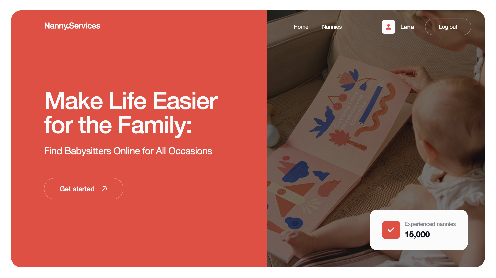
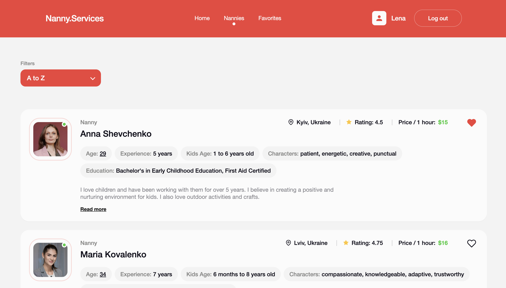
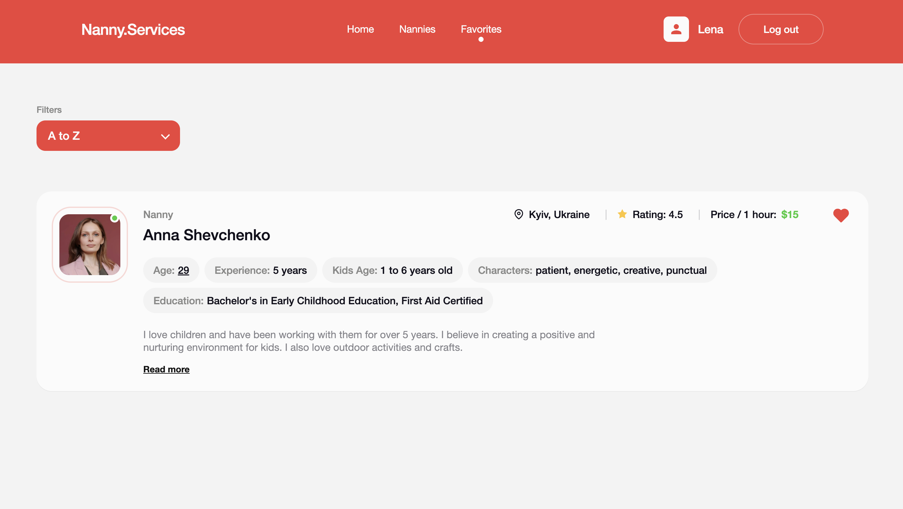

# 🧸 Nanny Services App

**Nanny Services** is a modern web application designed to help families find and connect with babysitters for various occasions.  
The platform provides a clean, intuitive, and responsive experience for browsing, filtering, and managing babysitter profiles.

---

## 🎥 Demo

- **Live demo**: https://nanny-app-sandy.vercel.app

## 🖼 Screenshots

### Home page


### Nannies page


### Favorites page


---

## ✨ Main Features

- 🔐 **User Authentication**  
  Secure registration and login using Firebase Authentication.

- 👩‍🍼 **Babysitter Listings**  
  Browse detailed nanny profiles with experience, ratings, location, and hourly price.

- 🔍 **Advanced Filters**  
  Sort and filter babysitters by:
  - Alphabetical order (A–Z / Z–A)
  - Price range
  - Popularity (rating)

- ❤️ **Favorites Management**  
  Save babysitters to a favorites list (available only for authenticated users).

- 📅 **Appointment Booking**  
  Book appointments with babysitters directly from their profile.

- 📱 **Fully Responsive Design**  
  Optimized layouts for desktop, tablet, and mobile devices (320px → 1440px).

---

## 🛠 Tech Stack

### Frontend
- **React**
- **React Router**
- **JavaScript**
- **Zustand**
- **Vite**

### Styling
- **CSS Modules**
- **modern-normalize**
- Responsive layout using Flexbox & CSS Grid

### Backend & Services
- **Firebase Authentication**
- **Firebase Realtime Database**

### Forms & Validation
- **React Hook Form**
- **Yup**

### UX Enhancements
- **react-hot-toast**

---

## 🔐 Authentication Flow

1. **Registration**
   - User signs up with name, email, and password.
   - Data is stored in Firebase Authentication and Realtime Database.

2. **Login**
   - User logs in using email and password.
   - Firebase manages the session.

3. **Protected Actions**
   - Favorites and appointment booking require authentication.
   - Unauthenticated users are prompted with a login modal.

---

## 📱 Responsive Design

The application is fully adaptive and works correctly across all screen sizes:

- **Desktop (≥1024px)**  
  Full layout with side-by-side sections and detailed cards.

- **Tablet (768px – 1023px)**  
  Reflowed layouts, adaptive grids, and resized UI elements.

- **Mobile (≤768px)**  
  Stacked layouts, touch-friendly buttons, adaptive headers and modals.

All layouts are fluid and scale smoothly between **320px and 1440px**.

---

## 📂 Project Structure

```text
src/
├── components/        # Reusable UI components
├── pages/             # Application pages (Home, Nannies, Favorites)
├── hooks/             # Custom React hooks
├── store/             # Zustand stores
├── firebase/          # Firebase configuration
├── assets/            # Images & icons
├── styles/            # Global styles
└── main.jsx
```

---

## 🚀 Getting Started

### 1. Clone the repository

```bash
git clone https://github.com/your-username/nanny-services.git
cd nanny-services
```

### 2. Install dependencies

```bash
npm install
```

### 3. Create environment variables

Create a `.env` file in the root directory and add:

```env
VITE_FIREBASE_API_KEY=your-firebase-api-key
VITE_FIREBASE_AUTH_DOMAIN=your-firebase-auth-domain
VITE_FIREBASE_DATABASE_URL=your-firebase-database-url
VITE_FIREBASE_PROJECT_ID=your-firebase-project-id
VITE_FIREBASE_STORAGE_BUCKET=your-firebase-storage-bucket
VITE_FIREBASE_MESSAGING_SENDER_ID=your-firebase-messaging-sender-id
VITE_FIREBASE_APP_ID=your-firebase-app-id
VITE_FIREBASE_MEASUREMENT_ID=your-firebase-measurement-id
```

### 4. Run the development server

```bash
npm run dev
```

### 5. Open in browser

```
http://localhost:5173
```

---

## ✅ Environment Requirements

- **Node.js** 16+ (recommended 18+)
- **npm** 8+
- Modern browser with ES6+ support
- Firebase project with:
  - Email/Password Authentication enabled
  - Realtime Database enabled

---

## 📌 Notes

- Favorites and appointment booking are available only for authenticated users.
- If a user is not logged in, the application shows a login modal when required.
